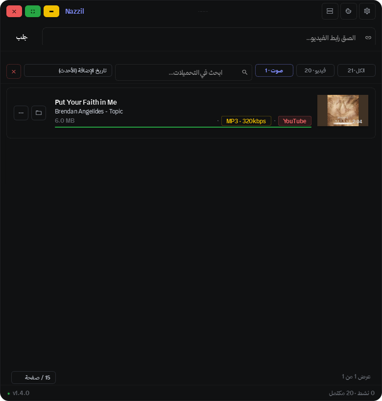

<div align="center">

<picture>
  
</picture>

<br/>
<br/>



<br/>
<br/>

[Download Latest Release](https://github.com/Hjbiki/Nazzil/releases/latest)

---

</div>

<div dir="rtl" align="right">

## نزّل

محمّل فيديوهات مجاني ومفتوح المصدر لسطح المكتب. الصق الرابط، اختر الجودة، وحمّل. يدعم يوتيوب وأكثر من 1800 موقع آخر.

---

### وش يسوي؟

نزّل تطبيق ويندوز مبني بـ Python و Qt، يستخدم yt-dlp للتحميل و ffmpeg للدمج والتحويل. صُمّم بأسلوب Linear مع واجهة نظيفة ومرتبة، ويدعم المظهرين الداكن والفاتح.

### صفر تثبيت

كل الأدوات مضمّنة داخل التطبيق — ffmpeg و ffprobe و aria2c. لا تحتاج لتثبيت أي شيء، ولا إلى تعديل PATH. مثبّت **NazzilSetup.exe** يعمل بدون إنترنت تمامًا بعد التثبيت.

### المميزات

**التحميل**

- تحميل فيديو + صوت بجودة تصل إلى 4K (MP4)
- تحميل صوت فقط بجودات 128 / 192 / 320 kbps (MP3) مع غلاف الألبوم والبيانات الوصفية — **الافتراضي 320 kbps**
- تحميلات متعددة بالتوازي، كل واحد بشريط تقدم مستقل
- دعم الكوكيز لفيديوهات الأعضاء والمحتوى المقيّد بالعمر (Firefox موصى به)
- دعم قوائم التشغيل مع إمكانية اختيار فيديوهات محددة
- إعادة المحاولة تلقائياً عند الفشل (حتى 5 مرات)
- تسريع التحميل عبر aria2c (مضمّن، اختياري — يعمل بصمت ويتراجع تلقائياً)
- كشف التكرار وحل تعارض أسماء الملفات

**الواجهة**

- مظهر داكن وفاتح مع تبديل فوري من الإعدادات بدون إعادة تشغيل
- نافذة بدون إطار مع شريط عنوان مخصص وزوايا مدوّرة
- زر تشغيل ▶ على كل تحميل مكتمل + قائمة (إظهار في المجلد، نسخ الرابط، إعادة تسمية، حذف)
- بحث وفرز وتصفية التحميلات (الكل / فيديو / صوت)
- ثمانية خيارات فرز: تاريخ الإضافة، الاسم، الحجم، المدة (تصاعدي وتنازلي)
- صفحات (15 / 30 / 50 لكل صفحة) ووضع مضغوط للصفوف
- مراقبة الحافظة: تعبئة الرابط تلقائياً وبدء الجلب
- نافذة اختصارات لوحة المفاتيح (F1)
- عارض صور مدمج للصور المصغرة مع تكبير وتدوير
- تصغير إلى منطقة الإشعارات مع تنبيه عند اكتمال جميع التحميلات
- نسخة واحدة فقط: فتح التطبيق مرة أخرى يُظهر النافذة الموجودة بدل فتح نسخة جديدة

**اللغات**

- عربي وإنجليزي مع تبديل فوري بدون إعادة تشغيل ودعم كامل للاتجاه من اليمين لليسار

**كشف المصدر**

- يكتشف الموقع تلقائياً ويعرضه بلون العلامة التجارية (يوتيوب، X، إنستغرام، تيك توك، فيميو، تويتش، ساوندكلاود، ديلي موشن، وغيرها)
- أي موقع غير معروف يُعرض باسم النطاق

**التحديث**

- يفحص التحديثات من GitHub Releases تلقائياً
- "تحقّق من التحديثات" يعرض نتيجة واضحة: يتوفّر تحديث (مع زر تحديث)، أو أنت على آخر إصدار، أو فشل الاتصال
- يحدّث نفسه بنقرة واحدة

### التثبيت

حمّل أحدث نسخة من صفحة [Releases](https://github.com/Hjbiki/Nazzil/releases/latest):

- **NazzilSetup.exe** — المثبّت الكامل (موصى به) — يعمل بدون إنترنت فور التثبيت
- **Nazzil.exe** — نسخة محمولة بدون تثبيت (تجلب الأدوات بصمت عند أول تشغيل)

### المتطلبات

لا يوجد. التطبيق يتضمّن كل ما يحتاجه — ffmpeg و ffprobe و aria2c مضمّنة بالكامل. لا حاجة لتثبيت أي أداة، ولا إلى PATH، ولا إنترنت بعد التثبيت.

### اختصارات لوحة المفاتيح

| الاختصار | الوظيفة |
|---|---|
| Ctrl+V | لصق الرابط وبدء الجلب |
| Ctrl+L | التركيز على حقل الرابط |
| Ctrl+F | التركيز على البحث |
| Ctrl+, | الإعدادات |
| Ctrl+M | التصغير إلى شريط المهام |
| F11 | تكبير / استعادة |
| Ctrl+W | الإغلاق إلى شريط المهام |
| F1 | عرض اختصارات لوحة المفاتيح |

### المطوّر

عناد عسكر

- [creators.sa/hibiki](https://creators.sa/hibiki)
- [tip.dokan.sa/hibiki](https://tip.dokan.sa/hibiki)

تم إنشاؤه بمساعدة كلود (Anthropic).

### الرخصة

مفتوح المصدر. راجع ملف LICENSE للتفاصيل.

---

</div>

## Nazzil

A free, open-source desktop video downloader. Paste a URL, pick your quality, download. Supports YouTube and 1800+ other sites.

---

### What is it?

Nazzil is a Windows desktop app built with Python and Qt. It uses yt-dlp for downloading and ffmpeg for merging and conversion. The interface follows a Linear-inspired design with both dark and light themes.

### Zero install

Every tool is bundled inside the app — ffmpeg, ffprobe, and aria2c. You never install anything and never touch PATH. The **NazzilSetup.exe** installer works fully offline after install.

### Features

**Downloading**

- Video + Audio downloads up to 4K (MP4)
- Audio-only extraction at 128 / 192 / 320 kbps (MP3) with embedded cover art and metadata - **default 320 kbps**
- Unlimited parallel downloads, each with its own progress bar
- Cookie support for members-only and age-restricted content (Firefox recommended)
- Playlist support with per-video selection
- Auto-retry on failure (up to 5 attempts)
- aria2c acceleration (bundled, optional - silent fallback if unavailable)
- Duplicate detection and file-name conflict resolution (replace / rename / cancel)

**Interface**

- Dark and Light themes with instant switching from Settings (no restart)
- Frameless window with a custom title bar and rounded corners
- A Play button on every completed download, plus a menu (show in folder, copy link, rename, delete)
- Search, sort, and filter downloads (All / Video / Audio tabs)
- Eight sort options: date added, name, size, duration (ascending and descending)
- Pagination (15 / 30 / 50 per page) and a compact row mode
- Clipboard watcher: auto-fills and fetches when a video URL is copied
- Keyboard shortcuts dialog (F1)
- Built-in image viewer for thumbnails with zoom and rotate
- Minimize to system tray with a notification when all downloads complete
- Single instance: launching Nazzil again brings the existing window to the front

**Languages**

- Arabic and English with instant live switching (no restart) and full RTL support

**Source detection**

- Detects the site automatically and shows it with a brand-coloured tag (YouTube, X, Instagram, TikTok, Vimeo, Twitch, SoundCloud, Dailymotion, and more)
- Any unknown site is shown by its domain name

**Updates**

- Checks GitHub Releases automatically
- "Check for updates" shows a clear result: an update is available (with an Update button), you are on the latest version, or the check failed
- Updates itself with one click

### Install

Download the latest build from the [Releases](https://github.com/Hjbiki/Nazzil/releases/latest) page:

- **NazzilSetup.exe** - full installer (recommended) - works offline right after install
- **Nazzil.exe** - portable, no install (fetches tools silently on first run)

### Requirements

None. Everything is bundled - ffmpeg, ffprobe, and aria2c ship with the app. No tool to install, no PATH setup, and no internet needed after install.

### Build from source

```bash
git clone https://github.com/Hjbiki/Nazzil.git
cd Nazzil
pip install -r requirements.txt
python main.py
```

To build the executable:

```bash
build.bat
```

### Keyboard shortcuts

| Shortcut | Action |
|---|---|
| Ctrl+V | Paste URL and fetch |
| Ctrl+L | Focus the URL field |
| Ctrl+F | Focus the search field |
| Ctrl+, | Open settings |
| Ctrl+M | Minimize to tray |
| F11 | Maximize / restore |
| Ctrl+W | Close to tray |
| F1 | Show keyboard shortcuts |

### Developer

Anad Askar

- [creators.sa/hibiki](https://creators.sa/hibiki)
- [tip.dokan.sa/hibiki](https://tip.dokan.sa/hibiki)

Built with the help of Claude (Anthropic).

### License

Open source. See the LICENSE file for details.
